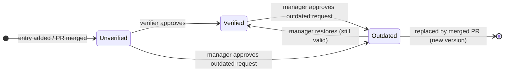
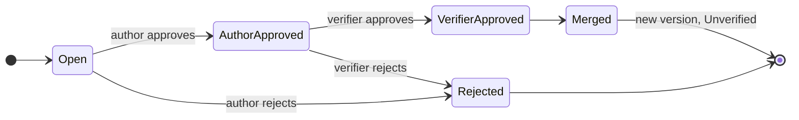

# Peerpoint — Functional Specification

*Tectonic Hackathon 2026 · SD Worx challenge · last updated 2026-09-30*

## Contents

1. [Purpose and scope](#1-purpose-and-scope)
2. [Actors and roles](#2-actors-and-roles)
3. [Key concepts and entry lifecycle](#3-key-concepts-and-entry-lifecycle)
4. [Functional requirements](#4-functional-requirements)
5. [Use cases](#5-use-cases)
6. [Business rules](#6-business-rules)
7. [Screens and notifications](#7-screens-and-notifications)
8. [Phasing and open questions](#8-phasing-and-open-questions)

---

## 1. Purpose and scope

Peerpoint is an internal knowledge database for SD Worx employees in which every entry carries human-processed feedback as trust signals. Algorithms help people find information; people decide whether it can be trusted.

Each entry stores the information itself plus four kinds of human feedback:

- **Verification** by a senior expert, team lead or manager, shown as a role badge.
- **Votes** from any employee who used the entry: a full usage record of who used it, when, where, and whether it was correct.
- **Outdated requests** when information stops being current: an employee explains why, a manager decides.
- **Contributions** through pull requests, recorded in a git-style version history.

This document defines what the system does: actors, entry lifecycle, functional requirements, use cases, business rules and screens. Architecture, stack and API are covered in the technical specification.

**PoC scope.** The hackathon proof of concept covers one category (freelance / contractor payroll), one primary role (payroll consultant) and the full loop: add → verify → search → use and cite → vote → request outdated → update via PR.

## 2. Actors and roles

Every user is an Employee; Author, Senior expert, Team lead / Manager and Admin add permissions on top. Verification authority is always scoped; "in scope" in this document means:

- **Senior expert** — entries of the departments an Admin has mapped to them.
- **Team lead / Manager** — only entries authored by members of their own team, taken from the org hierarchy. Verifying for their own team is each manager's and team lead's responsibility, so they never verify outside it, even within the same department.
- **Outdated requests** — decided only by managers and higher in the author's reporting line. Team leads and senior experts do not decide on them.

| Role | Who | Main responsibilities |
| --- | --- | --- |
| Employee | Every SD Worx user | Search, read, add entries, vote, request outdated, open PRs |
| Author | Creator or contributor of an entry | First approval of PRs on their entry, updates outdated entries via PR |
| Senior expert | Assigned by Admin per department | Verifies entries, second approval of PRs |
| Team lead / Manager | From the org hierarchy | Verifies entries and approves PRs for their own team only; managers and higher also decide on outdated requests |
| Admin | Platform owners | Roles, department mapping, categories, tags, thresholds |

### Permissions matrix

| Action | Employee | Author | Senior expert | Team lead / Manager | Admin |
| --- | --- | --- | --- | --- | --- |
| Search and read entries | Yes | Yes | Yes | Yes | Yes |
| Add an entry | Yes | Yes | Yes | Yes | Yes |
| Edit own unverified draft | Own only | Own only | Own only | Own only | No |
| Vote on an entry | Yes, not own | Not own | Not own | Not own | Yes, not own |
| Request that an entry is marked Outdated (with reason) | Yes | Yes | Yes | Yes | Yes |
| Approve or reject an outdated request | No | No | No | Managers and higher, author's line only | No |
| Open a pull request | Yes | Yes | Yes | Yes | Yes |
| Approve a PR (step 1) | No | Own entries | No | No | No |
| Approve a PR (step 2) | No | No | Mapped departments | Own team | No |
| Verify an entry version | No | Never own | Mapped departments | Own team | No |
| Restore an Outdated entry (still valid) | No | No | No | Managers and higher, author's line only | No |
| Manage roles, mapping, settings | No | No | No | No | Yes |

## 3. Key concepts and entry lifecycle

An entry's trust is always tied to one version: any change creates a new version that starts Unverified.

- **Entry** — one piece of knowledge with a permanent public ID, a scope (country, EU-wide, universal) and a department.
- **Version** — a full snapshot of the entry's content and tags. Verification and votes attach here.
- **Status** — Unverified, Verified or Outdated, per version.
- **Pull request (PR)** — a proposed change to an existing entry, used for duplicates and for updating outdated information.
- **Outdated request** — an employee's request, with a required reason, to mark a version Outdated. It changes nothing until a manager approves it.
- **Reference** — the public ID, optionally with a version, used to cite an entry.
- **Contributor** — anyone whose text is part of the entry: the original author and every employee whose merged PR added or changed a fragment. Each fragment knows which contributors are responsible for it.

### Entry version lifecycle

### Pull request lifecycle

A version becomes Verified only through a verifier. It becomes Outdated only when a manager approves an outdated request; it then ranks lower until a manager restores it or a merged PR replaces it with a new, Unverified version. Votes can be added in any status and belong to one version.

## 4. Functional requirements

Requirements are grouped by module. Phase marks what the hackathon PoC delivers (MVP) and what follows (Phase 2).

### Entries

| ID | Requirement | Phase |
| --- | --- | --- |
| FR-E1 | An employee can add an entry with title, content, justification (source or reasoning) and category. | MVP |
| FR-E2 | Every entry has tags: country, date, author, department, role, keywords. | MVP |
| FR-E3 | Every entry has a scope: country-specific, EU-wide (union) or universal. | MVP |
| FR-E4 | Every entry gets a permanent unique public ID on creation that never changes. | MVP |
| FR-E5 | A new entry is always saved as Unverified. | MVP |
| FR-E6 | Entries are shown in the reader's language first when a translation exists. | Phase 2 |

### Verification

| ID | Requirement | Phase |
| --- | --- | --- |
| FR-V1 | Senior experts, team leads and managers have an approval tab listing unverified versions in their scope. | MVP |
| FR-V2 | A verifier can approve a version; it becomes Verified with a role badge (Senior Expert, Team Lead, Manager). | MVP |
| FR-V3 | A verifier can send a version back to the author with a comment. | MVP |
| FR-V4 | Admins maintain the mapping of which senior experts may verify which departments. Team leads and managers verify only entries of their own team, based on the org hierarchy. | MVP |
| FR-V5 | Verification attaches to a version, not to the entry. A new version starts Unverified. | MVP |
| FR-V6 | Unverified entries show who to ask: the author and verifiers of that department. | MVP |

### Voting (peer review)

| ID | Requirement | Phase |
| --- | --- | --- |
| FR-P1 | Any employee can vote on an entry version by submitting a usage record: **used by** (filled in automatically), **when** (date of use), **where** (the case, process or document it was applied in) and **was it correct** (yes / no). All fields are required. | MVP |
| FR-P2 | One vote per user per version; users cannot vote on entries they authored or contributed to. | MVP |
| FR-P3 | Correct and incorrect votes are counted and shown separately as badges; they never replace verification. | MVP |
| FR-P4 | A user can edit or withdraw their own vote. | MVP |
| FR-P5 | The entry page lists all usage records of the current version: who, when, where, correct or not. | MVP |
| FR-P6 | An "incorrect" vote notifies the author and the last verifier. | MVP |

### Search

| ID | Requirement | Phase |
| --- | --- | --- |
| FR-S1 | One search bar across all categories, with filters for country, department, category and status. | MVP |
| FR-S2 | Results are ranked by relevance × trust weight (see [BR-1](#br-1-search-ranking)). | MVP |
| FR-S3 | Each result shows status and role badge, correct / incorrect vote counts, country, date and author. | MVP |
| FR-S4 | Unverified entries appear in search right after they are saved, with an **Unverified** tag; Outdated entries carry an **Outdated** tag. Both rank lower but are never hidden. | MVP |

### Citing

| ID | Requirement | Phase |
| --- | --- | --- |
| FR-C1 | Each entry has a copy-able reference (public ID, optionally with version). | MVP |
| FR-C2 | A reference to an old version shows that a newer version exists. | MVP |
| FR-C3 | The entry page shows where it has been cited, when citations are registered in the system. | Phase 2 |

### Duplicate detection and pull requests

| ID | Requirement | Phase |
| --- | --- | --- |
| FR-D1 | While an entry is written and on submit, it is compared with existing entries for similarity. | MVP (keyword), Phase 2 (embeddings) |
| FR-D2 | Above the similarity threshold, the user sees a warning with the similar entries and a "Create pull request" option. | MVP |
| FR-D3 | The user can still save a separate entry after the warning, with a short reason why it differs. It is not published directly: it waits for the same approvals as a PR (author of the similar entry, then a verifier in scope) and stays out of search until approved. | Phase 2 |
| FR-D4 | Any employee can open a PR on an existing entry via "Suggest change", with proposed content and a change note. | Phase 2 |
| FR-D5 | A PR is approved by the original author first, then by a verifier in scope. | Phase 2 |
| FR-D6 | Either approver can reject a PR with a reason. | Phase 2 |
| FR-D7 | On final approval the PR is merged into a new version, which is Unverified. | Phase 2 |

### Outdated entries

| ID | Requirement | Phase |
| --- | --- | --- |
| FR-O1 | Any employee can submit an outdated request on an entry. A reason explaining why it is outdated is required. | MVP |
| FR-O2 | The request goes to the approval tab of managers and higher in the author's reporting line; team leads and senior experts cannot decide on it. | MVP |
| FR-O3 | The manager approves the request, which marks the version Outdated, or rejects it with a comment; the requester and author are notified either way. | MVP |
| FR-O4 | While a request is pending, the entry keeps its status and ranking and shows an "outdated request pending" notice. | MVP |
| FR-O5 | Entries not updated for a configurable period show a "may be outdated" hint; this is a hint only and does not change the status. | MVP |
| FR-O6 | Outdated entries get a warning badge showing the approved reason, and a lower ranking. | MVP |
| FR-O7 | An Outdated entry is resolved by a merged PR, or by a manager restoring it as still valid. | MVP (restore), Phase 2 (PR) |

### Version history and contributors

Every piece of information shows who stands behind each part of it, so a reader always knows whom to ask.

| ID | Requirement | Phase |
| --- | --- | --- |
| FR-H1 | Every version is stored as a full snapshot with author, date and change note. | MVP |
| FR-H2 | Every entry shows a list of all its contributors, with name, role and reputation. | Phase 2 |
| FR-H3 | When a user selects a line or fragment of the text, the contributors responsible for it are shown next to that line, with a way to contact them. | Phase 2 |
| FR-H4 | Clicking a contributor in the list highlights all text in the current version that this contributor is responsible for. | Phase 2 |
| FR-H5 | At the bottom of the entry page, a git-style log lists all changes: version, author, date and change note, newest first. | Phase 2 |
| FR-H6 | Clicking a log item shows which text fragments that change added, edited or removed, and by whom. | Phase 2 |
| FR-H7 | History is append-only; no user can delete or rewrite past versions. | MVP |

### Reputation

| ID | Requirement | Phase |
| --- | --- | --- |
| FR-R1 | Users earn reputation when their entries are verified, voted on and cited, and when their PRs are merged. | MVP |
| FR-R2 | Reputation is shown on profiles and next to author names. | MVP |
| FR-R3 | Admins can see reputation per department to spot senior-expert candidates. | Phase 2 |

### Notifications

| ID | Requirement | Phase |
| --- | --- | --- |
| FR-N1 | In-app notifications for: new entry in scope, PR opened, approval needed, outdated request submitted or decided, entry verified, incorrect vote reported. | MVP |
| FR-N2 | E-mail notifications and scheduled reminders for pending approvals. | Phase 2 |
| FR-N3 | Teams / Slack notifications. | Phase 2 |

## 5. Use cases

Seven use cases cover the demo storyline end to end.

### UC-1 Add an entry

**Actor:** Employee A · **Covers:** FR-E1–E5, FR-D1–D3, FR-N1

1. A opens "Add entry", fills in title, content, justification, category and tags.
2. While A types, the system checks similarity with existing entries.
3. No similar entry: A submits; the entry is saved as Unverified with a new public ID.
4. Verifiers in scope are notified.

**Alternative:** a similar entry exists → A either opens a PR on it, or saves a separate entry with a reason, which then waits for PR approval before publication (see [UC-6](#uc-6-handle-a-duplicate-or-change-via-pull-request)).

**Acceptance criteria**

- [ ] The new entry has status Unverified and a unique public ID.
- [ ] The entry is findable in search immediately, tagged Unverified.
- [ ] Required fields (title, content, category, country) are validated before save.
- [ ] The entry appears in the approval tab of every verifier in scope, and nowhere else as pending.

### UC-2 Verify an entry

**Actor:** Senior expert, Team lead or Manager · **Covers:** FR-V1–V5

1. The verifier opens the approval tab and selects a pending version.
2. They review content, justification and tags.
3. They approve, or send it back with a comment.

**Acceptance criteria**

- [ ] On approval, the version becomes Verified and shows the verifier's role badge.
- [ ] A verifier cannot verify their own entry or an entry outside their scope (enforced server-side).
- [ ] The author is notified of the outcome.

### UC-3 Search and use an entry

**Actor:** Employee B · **Covers:** FR-S1–S4, FR-C1–C2

1. B types a question in the search bar, optionally filtering by country or department.
2. The system returns ranked results with badges.
3. B opens an entry, reads it and copies its reference to cite in their work.

**Acceptance criteria**

- [ ] Verified entries for B's country rank above unverified ones with similar relevance.
- [ ] Unverified entries are shown in the results with a visible Unverified tag.
- [ ] Every result shows status, role badge, correct / incorrect vote counts, country, date and author.
- [ ] The copied reference contains the public ID and version.

### UC-4 Vote on an entry

**Actor:** Employee B · **Covers:** FR-P1–P6, FR-R1

1. After using the entry, B clicks "Report usage".
2. B's name is filled in automatically; B enters when the entry was used, where (e.g. the case or process reference) and whether it was correct.
3. The usage record appears on the entry page and the matching counter increases.
4. A correct vote updates the author's reputation; an incorrect vote notifies the author and the last verifier.

**Acceptance criteria**

- [ ] A vote without date, context or outcome is rejected.
- [ ] The "where" field holds a reference to the case or process, not confidential customer data.
- [ ] A second vote by the same user on the same version is rejected; the user can edit their existing one instead.
- [ ] Authors and contributors cannot vote on their own entry.
- [ ] A vote attaches to the current version only.

### UC-5 Request that an entry is marked Outdated

**Actor:** Employee B, then a manager of the author's reporting line · **Covers:** FR-O1–O7

1. B notices the rule has changed and clicks "Request outdated", entering why the entry is outdated.
2. The request appears in the approval tab of the author's manager and higher; the entry shows an "outdated request pending" notice.
3. The manager reviews the reason and approves or rejects the request with a comment.
4. On approval, the entry gets an Outdated badge with the reason and drops in ranking. B and the author are notified.
5. The author or B opens a PR with the new information (UC-6), or later a manager restores the entry as still valid.

**Acceptance criteria**

- [ ] A request without a reason cannot be submitted.
- [ ] Only managers and higher in the author's reporting line can decide; team leads, senior experts and the requester cannot (enforced server-side).
- [ ] A pending request does not change the entry's status or ranking.
- [ ] The decision, the manager who made it and the reason are recorded in the change log.

### UC-6 Handle a duplicate or change via pull request

**Actor:** Employee C, author, verifier · **Covers:** FR-D2–D7, FR-H1

1. C writes an entry similar to A's; the system shows a warning with A's entry.
2. C chooses "Create pull request" and adds the new information to A's entry.
3. A approves the PR, then a verifier in scope approves it.
4. The PR is merged into a new version, which is Unverified until verified.

**Acceptance criteria**

- [ ] The approval order author → verifier cannot be skipped.
- [ ] The previous version remains in history and old references still resolve.
- [ ] C is recorded as contributor of the fragment they added.

### UC-7 Find whom to ask about a fragment

**Actor:** Employee B · **Covers:** FR-H2–H6

1. B reads an entry and has a question about one line.
2. B selects the line; the contributors responsible for it appear next to it.
3. B contacts one of them directly from there.
4. To understand how the line came to be, B opens the change log at the bottom of the page and clicks the change that introduced it, which shows the fragment and its author.
5. To see everything one colleague wrote, B clicks that contributor in the list; their text is highlighted.

**Acceptance criteria**

- [ ] Every line of the current version maps to at least one contributor.
- [ ] Selecting a line shows only the contributors responsible for that line, not all contributors of the entry.
- [ ] Clicking a log item shows exactly the fragments changed in that version, with the author of the change.
- [ ] Clicking a contributor highlights all their text, and clicking again removes the highlight.

## 6. Business rules

All thresholds and weights below are configurable by Admins; the values given are PoC defaults.

### BR-1 Search ranking

`score = text relevance × trust weight`

The trust weight combines, in order of importance:

1. Verification status and verifier's role level (Manager, Team lead, Senior expert, then Unverified).
2. Votes on the current version: correct votes raise the weight, incorrect votes lower it. A vote from a Senior expert counts 1.3× (30 % more) than a vote from other employees.
3. Country match: the searcher's country first, unless the entry is universal or EU-wide.
4. Freshness: Outdated entries drop in ranking; recency is a minor factor.
5. Author reputation, as a tie-breaker.

Unverified and Outdated entries are never hidden: they are shown with their tag and ranked lower.

### BR-2 Duplicates

- Similarity is checked against the current versions of all entries in the same language.
- Default warning threshold: 60 % similarity.
- The user may still save a separate entry with a reason, but it goes through the PR approval flow (author of the similar entry → verifier) before it is published. This prevents the warning from being bypassed with one click.

### BR-3 Versions and verification

- Verification and votes belong to one version. A merged PR creates a new version with status Unverified and zero votes.
- The previous version's verification and votes stay visible in history.
- References to older versions resolve and show that a newer version exists.

### BR-4 Outdated

- Marking an entry Outdated is always a request: any employee can submit one, a reason is required.
- Only managers and higher in the author's reporting line decide whether the request is correct. Nobody can approve their own request.
- One open request per entry version; further employees can add their reason to the existing request.
- Default "may be outdated" hint: no update for 12 months. The hint never changes the status.
- An Outdated entry leaves that status only through a merged PR or a manager restoring it.

### BR-5 Reputation

| Event | Points to |
| --- | --- |
| Entry version verified | Author |
| Correct vote received | Author (and contributors of that version) |
| PR merged | PR author |
| Entry cited | Author |

Point values are set by Admins.

### BR-6 Anti-gaming and integrity

- One vote per user per version; no votes on own entries or entries one contributed to.
- A vote is only valid as a complete usage record (who, when, where, correct or not).
- No reputation from one's own actions.
- Votes from the same small group of colleagues on one author are capped.
- Verification authority is always checked server-side: against the department mapping for senior experts, and against the org hierarchy (own team only) for team leads and managers.
- The PR approval order author → verifier is enforced; neither step can be skipped.
- Version history and the audit log are append-only.

### BR-7 Contributors and responsibility

- Responsibility is tracked per line of the current version, like `git blame`.
- A line's contributors are the author who wrote it and everyone whose merged change edited it.
- When a line is removed in a new version, its contributors are no longer shown for the current version, but remain visible in the change log.
- Verifiers and PR approvers are not contributors of a fragment unless they changed its text; their approval is shown in the change log.

## 7. Screens and notifications

Six screens cover all use cases.

| Screen | Main content | Key actions | Use cases |
| --- | --- | --- | --- |
| Search and results | Search bar, filters, ranked results with badges | Search, filter, open entry | UC-3 |
| Entry page | Content, justification, tags, status and role badge, correct / incorrect vote counts, usage records, reason if Outdated, list of contributors, git-style change log at the bottom | Copy reference, report usage (vote), request outdated, suggest change, select a line to see its contributors, click a contributor to highlight their text, click a log item to see what changed | UC-3, UC-4, UC-5, UC-7 |
| Add entry form | Fields and tags, live duplicate warning with similar entries | Save, create PR instead | UC-1, UC-6 |
| Approval tab | Queue of pending versions and PRs in scope, diff view; for managers also outdated requests | Verify, send back, approve or reject PR, approve or reject outdated request, restore Outdated entry | UC-2, UC-5, UC-6 |
| My contributions | Own entries, PRs and their status, reputation | Edit drafts, respond to PRs | UC-1, UC-6 |
| Admin panel | Roles, department mapping, categories, thresholds, point values | Manage settings | — |

### Notifications

| Event | Recipient | Channel (MVP) |
| --- | --- | --- |
| New entry in scope | Verifiers in scope (mapped senior experts, the author's team lead / manager) | In-app |
| Entry verified or sent back | Author | In-app |
| PR opened on an entry | Author | In-app |
| PR approved by author | Verifiers in scope | In-app |
| PR merged or rejected | PR author | In-app |
| Outdated request submitted | Managers and higher in the author's reporting line | In-app |
| Outdated request approved or rejected | Requester, author | In-app |
| Incorrect vote reported | Author, last verifier | In-app |

## 8. Phasing and open questions

**MVP (hackathon PoC):** entries with tags and public IDs; Unverified / Verified / Outdated statuses; approval tab with role badges; voting; ranked search; keyword-based duplicate warning; outdated requests with manager decision and restore; version snapshots; reputation; in-app notifications.

**Phase 2:** pull requests with author → verifier approval; embedding-based duplicate detection; contributor list, line-level contributors, contributor highlighting and change log with diffs; citation tracking; translations; e-mail, Teams and Slack notifications; analytics.

### Open questions

- [ ] What happens to an unapproved PR when the author has left the company — does it go straight to a verifier?
- [ ] Is 12 months the right default for the "may be outdated" hint in payroll, or should it follow the yearly legal cycle?
