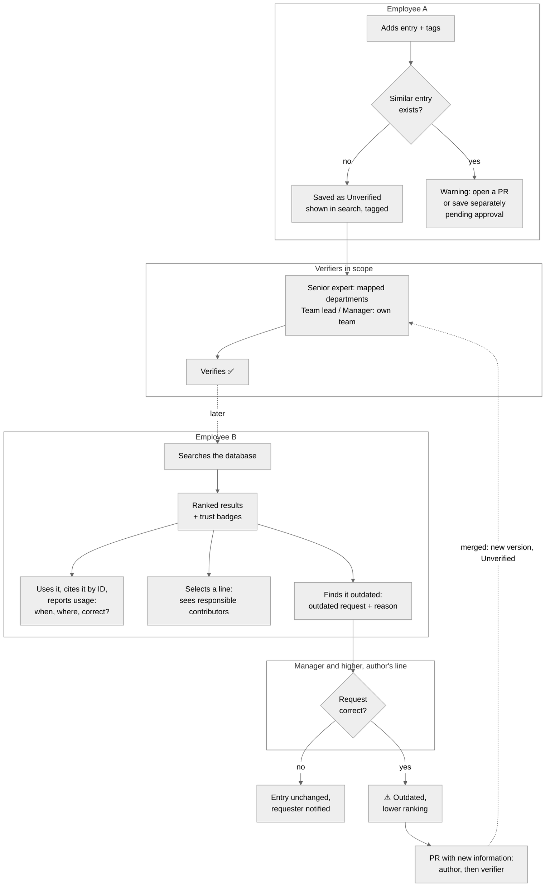
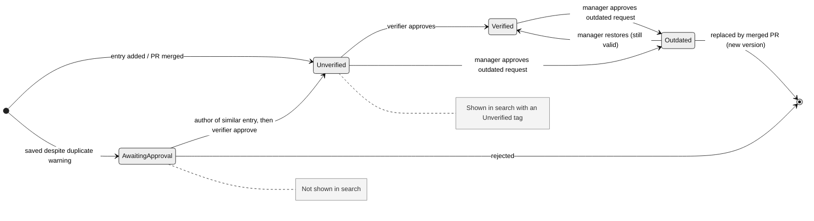
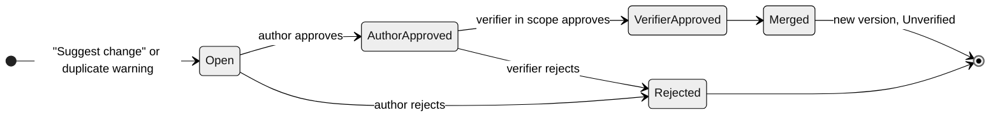
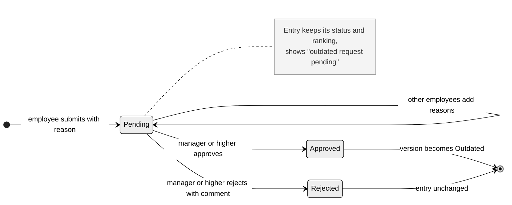
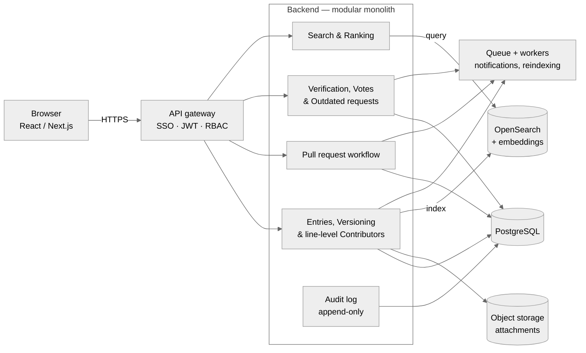
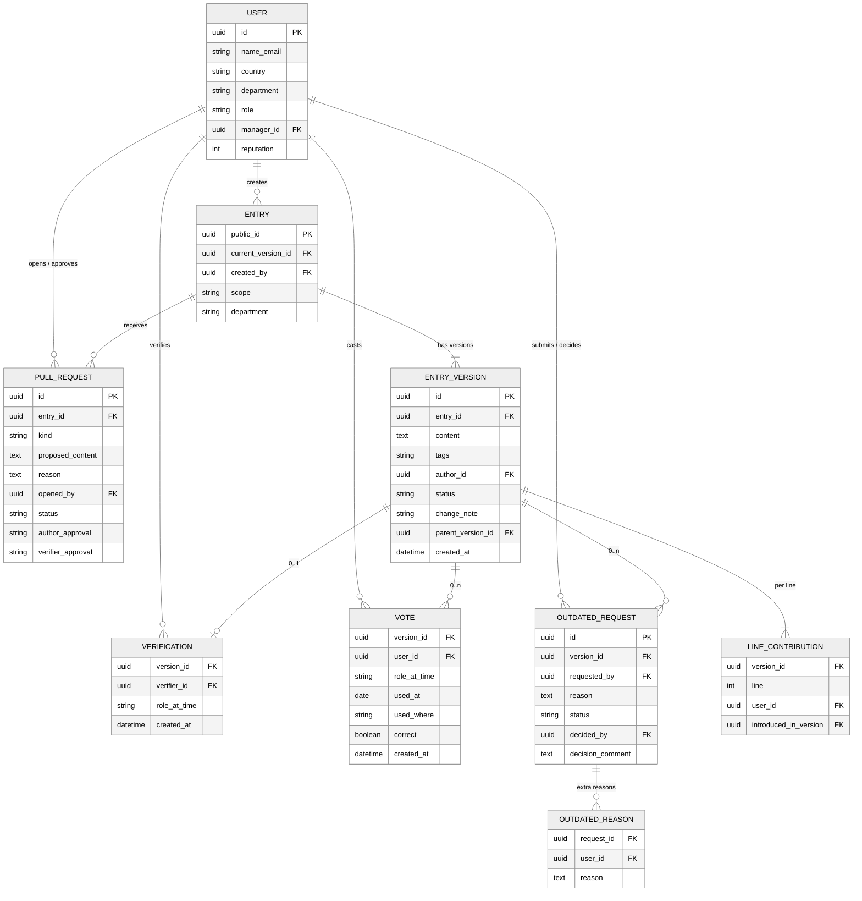

# CSD Forum — a knowledge database where trust comes from people

> **Tectonic Hackathon 2026 · SD Worx challenge: "Unlock the Knowledge Within — Find it. Understand it. Trust it."**

CSD Forum is an **internal knowledge database for SD Worx employees, enriched with human-processed feedback**. Every entry stores not only the information itself, but also the judgement of the people who work with it: who verified it, who used it where and whether it was correct, whether it is still current, and who is responsible for each part of the text.

Algorithms help to *find* information (search, similarity, duplicate detection). **People decide whether it can be trusted.** That trust is stored alongside the data as visible signals built from three ideas:

- **Hierarchical verification** — senior experts, team leads and managers approve entries, which then carry a role badge such as *"Verified by Senior Expert"* or *"Verified by Manager"*.
- **Peer review (from academia)** — every employee can vote on an entry they used, with a full usage record: who, when, where and whether it was correct.
- **Git-style version control** — duplicates and outdated information become pull requests to the existing entry, and every line shows who is responsible for it.

Every entry answers the question *and* shows **why you can rely on it and who to ask about it**.

📄 Full functional specification: [`FUNCTIONAL_SPEC.md`](FUNCTIONAL_SPEC.md)

---

## The problem

At SD Worx, knowledge lives in policies, manuals, Teams chats, e-mails, meetings and the heads of experienced colleagues. There is no single place to find it, and no way to tell whether a piece of information is trustworthy or outdated.

> *Is this answer reliable, current, and relevant to **my** customer and **my** country?*

A payroll consultant who finds three documents — one recent, one without an owner, one for another country — has *found* information but still **cannot act on it with confidence**. An AI assistant can summarise those documents, but it cannot tell which one is right: that knowledge sits with people, and today it is never captured.

## Our idea: human feedback as part of the data

A typical knowledge base or shared drive stores documents, but not what people *know about* those documents: whether they were checked, whether they worked in practice, whether they are still valid. CSD Forum captures that feedback, has it processed by the right people, and turns it into trust signals, borrowing proven mechanisms from science and from software engineering:

| In a typical knowledge base | In CSD Forum | Borrowed from |
|---|---|---|
| Anyone uploads, nobody checks | Entries start *Unverified*; a senior expert, team lead or manager verifies them | Journal editor |
| A "was this helpful?" button, or nothing | A vote is a usage record: who used it, when, where, and was it correct | Peer review |
| Link to a file that may move or change | Cite an entry by its **permanent ID** | Citation / DOI |
| Unclear who the expert is | Reputation from verified, voted and cited entries | Citation impact |
| Duplicate documents pile up | A duplicate becomes a **pull request** to the existing entry | Git |
| Documents go stale silently | An **outdated request** with a reason, decided by a manager | Errata |
| Unclear who wrote which part | Select a line to see who is responsible for it | Git blame |
| Files get overwritten, history is lost | Full change log, each change showing what it changed and by whom | Git log |

No black box: every ranking can be explained by the human feedback behind it.

---

## Demo storyline

1. **Employee A** adds an entry in the *Freelance payroll* category with tags (country, department, role) and a justification. It is saved as 🟡 **Unverified** and is immediately findable in search, tagged as such.
2. **A senior expert** mapped to the payroll department sees it in the **approval tab** and approves it — the entry gets a ✅ **Verified by Senior Expert** badge.
3. *Some time later*, **Employee B** searches the database. Ranked results show trust badges: *Verified by Senior Expert · 12 correct / 0 incorrect · Belgium · 2026*.
4. B uses the information, **cites it by its ID**, and **reports the usage**: when, in which case, and that it was correct.
5. B has a question about one paragraph, **selects that line**, and sees which colleagues are responsible for it.
6. Months later, a rule changes. B submits an **outdated request** with the reason. **A's manager** approves it — the entry gets an ⚠️ **Outdated** badge and drops in ranking.
7. B clicks **"Suggest change"** and opens a pull request with the new rule. The author approves, then a verifier; the entry gets a new version, which is Unverified again until re-verified. The **change log** at the bottom of the page shows exactly what B changed.
8. **Employee C** starts writing an entry that is 70 % similar to A's. CSD Forum shows a **live duplicate warning** and offers to open a pull request on A's entry instead.

---

## Features

### 1. Entries, tags and categories
- Entries are organised in **categories** by domain (e.g. *Freelance payroll*, *Leave & absence*) and tagged with **country, date, author, department and role**.
- Each entry has a **scope**: country-specific, EU-wide (union) or universal.
- Every entry has a **permanent unique ID** that colleagues use to cite it.
- A new entry is always **Unverified**, and is shown in search right away with an Unverified tag.

### 2. Verification
- Verifiers have an **approval tab** with the unverified entries in their scope, plus notifications.
- Scope depends on the role:
  - **Senior experts** verify entries of the departments an admin has mapped to them.
  - **Team leads and managers** verify only entries of **their own team**, from the org hierarchy. This is each manager's responsibility, so they never verify outside their team.
- Approval gives a **role badge** (*Verified by Senior Expert / Team Lead / Manager*).
- Verification belongs to one **version**: any merged change starts a new, Unverified version.
- Unverified entries point to **who to ask**: the author and verifiers of that department.

### 3. Votes as usage records
- Only verifiers can *verify*, but **every employee can vote**.
- A vote is a full **usage record**: **used by** (automatic), **when**, **where** (the case, process or document — a reference, not confidential customer data) and **was it correct** (yes / no).
- Correct and incorrect votes are counted and shown **separately**; an incorrect vote notifies the author and the last verifier.
- The entry page lists all usage records of the current version.
- One vote per user per version; no votes on one's own entries or entries one contributed to.
- A vote from a **senior expert weighs 30 % more** in ranking.

### 4. Trust-aware search
- One search bar across all categories, with filters for country, department, category and status.
- **Unverified and Outdated entries are never hidden**: they appear with their tag and rank lower.
- **Score = text relevance × trust weight**, the trust weight combining, in order of importance:
  1. verification status and role level of the verifier;
  2. correct votes (up) and incorrect votes (down), senior-expert votes × 1.3;
  3. country match — your country first, unless the entry is universal or EU-wide;
  4. freshness: Outdated entries drop in ranking, recency is a minor factor;
  5. author reputation, as a tie-breaker.
- All weights are configurable.

### 5. Duplicates become pull requests
Duplicated knowledge splits trust: two half-verified entries are worth less than one well-verified entry.

- **Live duplicate warning.** While an entry is being written, it is compared with existing entries. Above a configurable threshold (e.g. **60 %**), the user sees the similar entries and is offered **"Create pull request"** instead.
- The user can still save a **separate entry** with a reason, but it waits for the same approvals as a PR before it is published, so the warning can't be bypassed with one click.
- **Approval order:** the original author approves first, then a verifier. The merged change becomes a **new version, which is Unverified again**.

### 6. Contributors and change log
Every piece of information shows who stands behind each part of it.

- Each entry shows the **list of all contributors**.
- **Select a line** → the contributors responsible for that line appear next to it, ready to be contacted.
- **Click a contributor** → all text they are responsible for is highlighted.
- At the bottom of the page, a **git-style change log** lists every change; **click a change** → see which fragments it added, edited or removed, and by whom.
- Responsibility is tracked per line, like `git blame`; history is append-only.

### 7. Outdated requests
Rules in payroll change: tax rates, legal thresholds, collective agreements.

- Any employee can submit an **outdated request**; a **reason is required** (e.g. *"new rate since 2027"*).
- Only **managers and higher** in the author's reporting line decide whether the request is correct. Nobody decides on their own request.
- While pending, the entry keeps its status and shows an "outdated request pending" notice.
- Once approved, the entry gets an ⚠️ **Outdated** badge with the reason and drops in ranking.
- It is resolved by a **pull request with the new information**, or by a manager restoring it as still valid.
- Entries untouched for a configurable period (default 12 months) show a **"may be outdated"** hint, which never changes the status by itself.

### 8. Reputation
- Users earn **reputation** when their entries are verified, receive correct votes and are cited, and when their pull requests are merged.
- Reputation is shown on profiles and next to author names, so colleagues see **who the go-to experts are**.
- Anti-gaming: no reputation from own actions, and votes from the same small group of colleagues are capped.

---

## Roles and permissions

| Role | Permissions |
|---|---|
| Employee | Search, add entries, edit own drafts, vote (usage record), submit outdated requests, open PRs |
| Author | Approve or reject PRs on their own entries |
| Senior expert | Verify entries and approve PRs in their mapped departments |
| Team lead | Verify entries and approve PRs for their own team |
| Manager (and higher) | Same as team lead, plus decide on outdated requests and restore Outdated entries in their reporting line |
| Admin | Manage roles, department mapping, categories, tags, thresholds and weights |

## State machines

**Entry version**

**Pull request**

**Outdated request**

## Architecture

A modular monolith is enough to start; modules can be split into services later. PostgreSQL is the source of truth, OpenSearch powers search and similarity, and a queue with workers handles notifications and reindexing.

## Data model

`status` of a version is `awaiting_approval | unverified | verified | outdated`. `kind` of a pull request is `change | separate_entry` (an entry saved despite a duplicate warning). `role_at_time` on a verification or vote is `employee | senior expert | team lead | manager`, so senior-expert votes can weigh 1.3×. An outdated request's `status` is `pending | approved | rejected`. `Notification` and an append-only `AuditLog` complete the model.

## API sketch

| Endpoint | Purpose |
|---|---|
| `POST /entries` | Create an entry |
| `GET /entries/:id`, `/entries/:id/versions` | Read entry and change log |
| `GET /entries/:id/contributors` | Contributors, per line of the current version |
| `GET /versions/:id/diff` | What a version changed, and by whom |
| `POST /entries/:id/pull-requests` | Open a PR |
| `POST /pull-requests/:id/approve` | Author or verifier approval |
| `POST /versions/:id/verify` | Verification |
| `POST /versions/:id/votes` | Vote with usage record (when, where, correct) |
| `POST /entries/:id/outdated-requests` | Submit an outdated request with reason |
| `POST /outdated-requests/:id/decision` | Manager approves or rejects |
| `GET /search?q=&country=&dept=&status=` | Ranked search |
| `GET /approvals/pending` | Approval queue |
| `GET /users/:id/reputation` | Reputation |

---

## Scope

Following the challenge advice to *"choose one meaningful problem"*, the proof of concept focuses on **one category: freelance / contractor payroll**, one role (payroll consultant) and one workflow.

**MVP:** entries with tags and public IDs; Unverified / Verified / Outdated statuses; approval tab with role badges; votes as usage records; ranked search with tags; keyword-based duplicate warning; outdated requests with manager decision; version snapshots; reputation; in-app notifications.

**Phase 2:** pull requests with author → verifier approval; embedding-based duplicate detection; contributor list, line-level contributors, highlighting and change log with diffs; citation tracking; translations; e-mail, Teams and Slack notifications; analytics.

How it maps onto the SD Worx inspiration areas:
- **Trust** — role badges, correct / incorrect votes with usage records, reputation and explainable ranking.
- **Capture** — knowledge moves out of chats, inboxes and heads into citable entries.
- **Detect** — duplicates are caught before they are created; outdated information is reported with a reason and confirmed by a manager.
- **Connect** — every line shows who is responsible for it, and reputation shows who the experts are.

