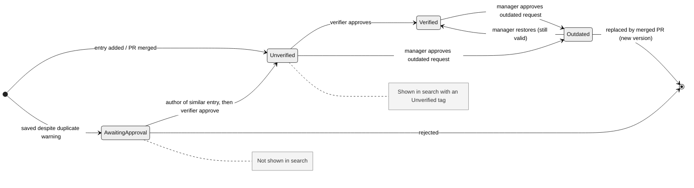
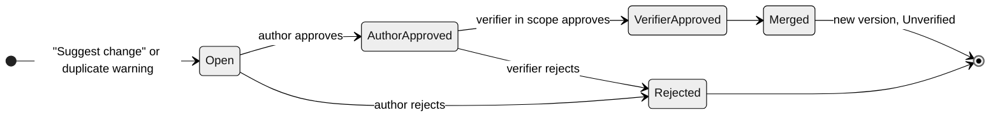
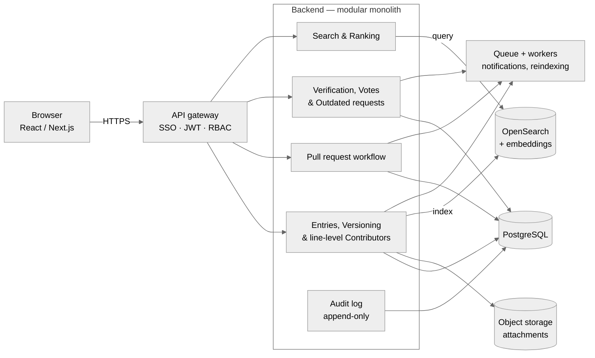

# CSD Forum — a knowledge database where trust comes from people

Internal knowledge base with human trust signals. Hackathon MVP covering Iterations 0–7.

CSD Forum is an **internal knowledge database for SD Worx employees, enriched with human-processed feedback**. Every entry stores not only the information itself, but also the judgement of the people who work with it: who verified it, who used it where and whether it was correct, whether it is still current, and who is responsible for each part of the text.

- **Backend:** FastAPI + SQLAlchemy 2 + SQLite (Python 3.11)
- **Frontend:** Vite + React + TypeScript + Tailwind CSS + Lucide icons

- **Hierarchical verification** — senior experts, team leads and managers approve entries, which then carry a role badge such as *"Verified by Senior Expert"* or *"Verified by Manager"*.
- **Peer review (from academia)** — every employee can vote on an entry they used, with a full usage record: who, when, where and whether it was correct.
- **Git-style version control** — duplicates and outdated information become pull requests to the existing entry, and every line shows who is responsible for it.

Every entry answers the question *and* shows **why you can rely on it and who to ask about it**.

```bash
cd backend
/usr/local/bin/python3.11 -m venv .venv
source .venv/bin/activate
pip install -r requirements.txt
.venv/bin/python -m uvicorn app.main:app --reload --port 8001
```

Health: http://127.0.0.1:8001/health

If port 8000 is free you can use 8000; the frontend proxy is set to 8001.

---

## Roles and permissions

| Role | Permissions |
|---|---|
| Employee | Search, add entries, edit own drafts, vote (usage record), submit outdated requests, open PRs |
| Author | Approve or reject PRs on their own entries |
| Senior expert | Verify entries and approve PRs in their mapped departments |
| Team lead | Verify entries and approve PRs for their own team |
| Manager (and higher) | Same as team lead, plus decide on outdated requests and restore Outdated entries in their reporting line |
| Admin | Manage roles, department mapping, categories, tags, thresholds and weights |

## State machines

**Entry version**



**Pull request**



Open http://localhost:5173 and pick a demo user.

A modular monolith is enough to start; modules can be split into services later. PostgreSQL is the source of truth, OpenSearch powers search and similarity, and a queue with workers handles notifications and reindexing.



## Demo users

| Name | Roles |
|------|-------|
| Employee A | employee |
| Employee B | employee |
| Employee C | employee |
| Senior Expert | employee, expert (Payroll dept) |
| Team Lead | employee, team_lead (own team) |
| Manager | employee, manager (own team) |
| Admin | employee, admin |

## Iterations implemented

- **0:** FastAPI + SQLite schema, seed data, React + Tailwind shell, dev login
- **1:** Entries, versions, public IDs, add-entry form, entry page
- **2:** Approval tab with dual-scope verification (dept experts + own-team TL/manager)
- **3:** Ranked search
- **4:** Usage-record votes (when/where/correct), reputation, incorrect-vote notifications
- **5:** Outdated flags and verifier confirmation
- **6:** Keyword duplicate-detection warning on add entry
- **7:** In-app notifications, My contributions, Admin panel

## Notes

- Scope values: `country`, `eu`, `universal`
- Public ID format: `PP-{CC}-{CAT}-{seq}` e.g. `PP-BE-FRE-00042`
